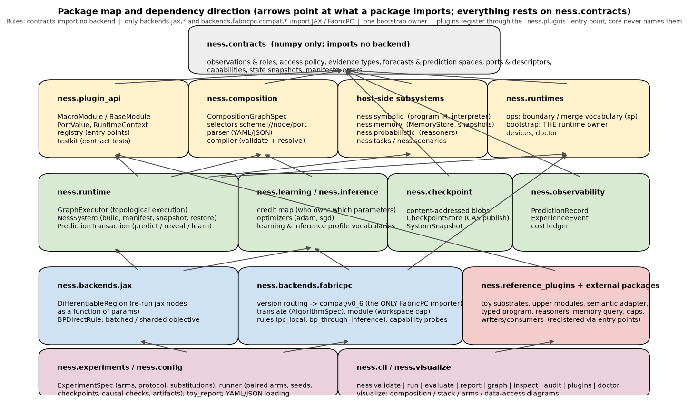
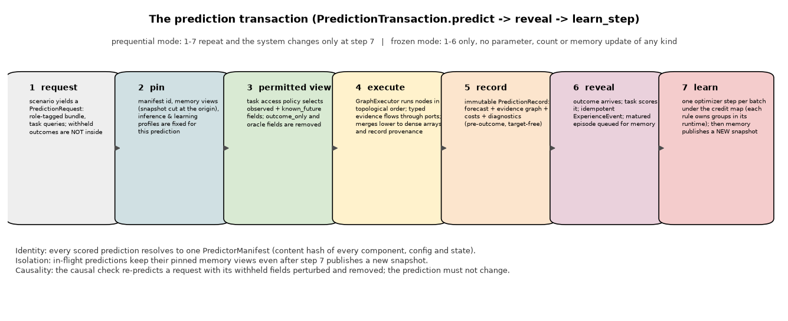

# NESS platform: architecture, interfaces and how it is built

This document explains the platform from two sides: **what a user sees** (the experiment file,
its concepts, the plugins, the CLI, the artifacts) and **how the code is built** (packages,
contracts, the composition compiler, the runtime and its backends, the prediction transaction,
learning, memory, checkpoints, experiments). The [quick start](QUICKSTART.md) is the tutorial
version of the first half; this is the reference. `IMPLEMENTATION_STATUS.md` records what is
verified, experimental or design-only.

**Contents**

1. [Summary](#1-summary)
2. [The user's model of NESS](#2-the-users-model-of-ness)
3. [Package map and dependency direction](#3-package-map-and-dependency-direction)
4. [Contracts](#4-contracts)
5. [The composition graph and its compiler](#5-the-composition-graph-and-its-compiler)
6. [Plugins and the plugin API](#6-plugins-and-the-plugin-api)
7. [Runtimes, backends, learning and inference](#7-runtimes-backends-learning-and-inference)
8. [Host-side subsystems: symbolic, memory, probabilistic](#8-host-side-subsystems-symbolic-memory-probabilistic)
9. [Execution: system, transaction, identity, checkpoints](#9-execution-system-transaction-identity-checkpoints)
10. [Experiments: specification, runner, artifacts, reports, diagrams](#10-experiments-specification-runner-artifacts-reports-diagrams)
11. [Command-line reference](#11-command-line-reference)
12. [Extension points](#12-extension-points)
13. [Design rules and their enforcement](#13-design-rules-and-their-enforcement)
14. [Test map](#14-test-map)

## 1. Summary

NESS is a research platform for *predictive systems built from typed evidence*. One or more
lower **substrates** (frozen or trainable models) produce representations and native
forecasts; **semantic adapters**, typed **symbolic programs**, **probabilistic reasoners** and
pinned **memory queries** turn those into explicit, provenance-carrying evidence; a trainable
**upper module** and a **cap** (a consumer plus a baseline-preserving writer) turn everything
into a forecast in a declared **prediction space**; a **task** scores it only after the outcome
is revealed. Which of these layers exist, which plugin fills each, and how they are wired is
configuration, not code.

The codebase implements the NESS/FabricPC cross-domain design specification (an external
document, cited here as "PDF §n") and the collaborator-facing extensions of its coding-agent
handoff addendum (external, cited as "addendum §n"; neither is distributed in this repository)
as a **plugin platform**. The scientific question is visible in configuration and manifests:
which substrates ran, which earlier ports each module read, which symbolic and probabilistic
computations executed, which memory snapshot was pinned, which cap wrote the output, which
learning rule owned which parameters, and which checkpoint produced every prediction.

Delivered and verified:

* a typed **contracts** package (evidence, forecasts, coordinates, availability roles,
  requests/outcomes, ports, capabilities, state snapshots, manifests) with no heavyweight
  dependencies;
* a **macro composition graph** (`ness.composition/1`): named typed ports, `scheme://node/port`
  source selectors, a small fixed vocabulary of boundary transforms and merges, a compiler that
  resolves and validates every edge (DAG-ness, access policy, shapes, coordinates, gradient
  boundaries) and records the resolved graph;
* a **plugin API** with entry-point discovery, lazy imports, declared optional dependencies, and
  a contributor **test kit** of contract-test mixins;
* host-side subsystems: a typed **program IR** and reference interpreter, an immutable
  **memory snapshot store** with fork/append/seal and pinned causal views, an **exact finite
  probabilistic reasoner** plus an importance-sampling comparator;
* two optional numerical backends behind one contract layer: the **NESS JAX backend**
  (`ness.backends.jax`: differentiable region, `bp_direct`, NESS-owned batched/sharded
  gradients) and the **FabricPC backend** (`ness.backends.fabricpc`: version-routed adapter for
  FabricPC 0.6.x, a FabricPC predictive-coding workspace cap, PC-local and BP-through-inference
  learning rules, probe-based capabilities); a credit map that refuses cross-runtime derivative
  paths and supports hybrid ownership; numpy optimizers with restorable state;
* a **single runtime bootstrap owner** (`ness.runtimes.bootstrap`) with a device specification
  (requested / visible / selected / realized), `ness doctor`, and subprocess import-order tests;
* the **prediction transaction** (pin, validate, execute, record, reveal, learn), whole-system
  **manifests and checkpoints** (content-addressed blobs, staged atomic publication, restore that
  re-instantiates plugins from the manifest and treats state as data);
* an **experiment runner** with paired arms on identical request streams, model seeds,
  configuration-only substitution proofs, checkpoint-restore and causal checks, structured raw
  artifacts; `ness report` (figures and a Markdown report from saved artifacts) and `ness graph`
  (diagrams of any configuration);
* the executed **toy vertical slice** (six arms, ten substitutions, three seeds, LaTeX/PDF
  write-up in `reports/`), seven quick-start examples and two architecture examples, and an
  **external example plugin package** that registers without editing core code.

Not delivered (declared, fail explicitly): Hyperon-backed memory, TimesFM or vision/text
providers, composition-level recurrent `InferenceWorkspace` regions (a recurrent FabricPC
workspace *node* exists, experimental), centered-nudge / equilibrium-propagation rules, model
parallelism, multi-host execution, the reference44 numerical port. Their names exist in the
capability vocabulary with status `unsupported` or `experimental`, so selecting them is a
launch error or an explicit opt-in, never a fallback.

## 2. The user's model of NESS

A user writes **one experiment file** and, when the shipped plugins are not enough, **one
plugin package**. The experiment file names:

| section | concept | in the code |
|---|---|---|
| `scenario` | the data provider: role-tagged observation fields, requests per split, outcomes revealed later | `ScenarioProvider` (`ness.plugin_api.protocols`), `ness.scenarios` |
| `tasks` | what is predicted and how it is scored; the access policy (permitted roles and memory namespaces) | `PredictionTask`, `ness.tasks` |
| `protocol` | the paired training/evaluation procedure: splits, batch size, updates, seeds, checks | `ness.experiments.runner` |
| `runtime` | which numerical backend and devices the process bootstraps | `ness.runtimes.bootstrap`, `ness.runtimes.devices` |
| `arms` | complete predictors compared on identical request streams | `ArmSpec`, `NessSystem` |
| `arms.<id>.composition` | the DAG of nodes (plugin instances) and the output port per task | `CompositionGraphSpec`, `compile_graph` |
| `arms.<id>.learning` / `inference` | how parameters change / how the workspace computes a prediction | `ness.learning`, `ness.inference`, backend rules |
| `arms.<id>.memory` | an optional memory store attached to the arm; nodes read pinned views | `ness.memory`, `MemoryAttachment` |
| `substitutions` | arms that must validate, predict target-free, pass the causal check, train once and restore | `run_substitution` |

The layers of a predictor and the plugin kinds that fill them:

| layer | kind | reads | emits |
|---|---|---|---|
| observations | (scenario fields) | | `observation://<field>` with a role |
| lower substrate | `substrate` | observation fields | `state/*` (neural states), `forecast/*` (native forecasts), all stop-gradient |
| upper module | `upper_module` | substrate states, other neural ports | `hidden`, `sequence` (differentiable, trainable) |
| semantic adapter | `semantic_adapter` | raw fields and any earlier port | `features` (typed `FeatureEvidence`) |
| typed program | `program` | bound ports | `value` (interpreted, budgeted, fail-closed) |
| probabilistic reasoner | `reasoner` | feature ports | `posterior` (`HypothesisEvidence` with honest weight semantics) |
| memory query | `memory_query` | a pinned memory view + a query port | `evidence`, `retrieval` |
| cap | `cap` | a baseline forecast + feature ports | `forecast` in the task's prediction space, `correction` |

Two rules govern every wire: a node reads only what the task view permits, and gradients never
cross a runtime boundary. The [quick start](QUICKSTART.md) explains each concept with examples,
lists every shipped plugin's ports and configuration keys (§7), and shows three architectures
drawn by `ness graph` (§9).

## 3. Package map and dependency direction



```
src/ness/
  contracts/        typed data contracts (numpy only)                         <- everything
  plugin_api/       MacroModule/PortValue/RuntimeContext, BaseModule, registry, testkit
  composition/      CompositionGraphSpec, selectors, YAML/JSON parser, compiler
  runtimes/         ops (boundary/merge vocabulary, xp-parametrised); bootstrap (THE runtime owner);
                    devices (DeviceSpec/resolution); doctor; jax_runtime (compat shim)
  backends/jax/     NESS JAX backend: DifferentiableRegion, BPDirectRule, batched/sharded objective
  backends/fabricpc/ FabricPC backend: version routing, translate (AlgorithmSpec), compat/v0_6 (only
                    FabricPC importer), module (workspace cap), rules, capabilities (probes), checkpoint
  runtime/          GraphExecutor, input assembly, NessSystem, PredictionTransaction
  learning/         CreditMap, optimizers, learning-profile vocabulary
  inference/        inference-profile vocabulary
  symbolic/         ProgramIR, primitives, RelationWorld, ReferenceInterpreter
  memory/           MemoryStore contract, InMemorySnapshotStore, QueryPlan/QueryResult
  probabilistic/    FiniteLatentModel, Exact / ImportanceSampling reasoners
  scenarios/        ScenarioProvider helpers, ToyTemporalDataset, ToyRegimeDataset
  tasks/            access policies, PointForecastTask, QuantileForecastTask
  checkpoint/       LocalBlobStore, CheckpointStore, SystemSnapshot
  experiments/      ExperimentSpec parsing, runner, artifacts, toy_report
  visualize/        ness graph: composition / stack / arms / data-access diagrams
  observability/    PredictionRecord, ExperienceEvent
  reference_plugins/ toy substrates, upper modules, semantic adapter, program node, memory query, caps,
                    writers/consumers, descriptors (registered through the same entry point as third parties)
  config/           YAML/JSON loading
  cli/              the `ness` command
```

Rules enforced by construction and by tests:

* `contracts` imports neither FabricPC, Hyperon, JAX nor a modality framework. Only
  `ness.backends.jax.*` and `ness.backends.fabricpc.compat.*` import JAX/FabricPC, and only
  plugins that declare `runtime = "jax"` / `"fabricpc"` import those modules. `import ness`,
  `ness plugins`, `ness validate --schema-only`, `ness audit` and `ness doctor --backend numpy`
  never import or initialise JAX (subprocess tests: `tests/test_bootstrap_import_order.py`).
* Exactly one place initialises a numerical backend: `ness.runtimes.bootstrap.bootstrap`,
  called by `NessSystem.build`, the runner and the CLI before any module state exists. It calls
  FabricPC's `setup_jax` before the first JAX computation, respects the user's `JAX_PLATFORMS`
  and `XLA_FLAGS`, resolves the experiment's `runtime.devices` spec and records a report. A later
  request that pins a platform is judged against the platform the process actually realised.
* The core knows *kinds, ports and capabilities*, not domains. There is no `if modality ==`
  anywhere; test `T17` runs a mock provider with an unseen modality through the unchanged
  executor.
* Backends depend on contracts, never the reverse. Reference plugins are registered through the
  same entry-point group (`ness.plugins`) that third-party packages use; the core registry never
  names them.

Installation levels follow the same layering: `ness` (core), `ness[jax]`, `ness[fabricpc]`
(implies JAX), `ness[report]` (matplotlib, pandas for `ness report` and `ness graph`).
`docs/INSTALL.md` has the details; NESS never pins `jaxlib` or CUDA plugin wheels.

## 4. Contracts

`ness.contracts` is the vocabulary every other package speaks. Its classes are frozen
dataclasses with canonical (hashable) forms; nothing in it imports a backend.

| concept | class | essential rule |
|---|---|---|
| observation | `Observation`, `ObservationBundle`, `ObservationField` | role-tagged (`observed`, `known_future`, `derived`, `outcome_only`, `evaluation_oracle`), named axes, `available_at` |
| information boundary | `AccessPolicy`, `AvailabilityCut` | a policy can never allow outcome/oracle roles; `bundle.select(policy)` is the only way to obtain a prediction-time view; the cut filters memory records by `available_at` |
| forecast | `PointForecast`, `QuantileForecast`, `CategoricalForecast`, `SampleForecast` + `ForecastCapabilities` | each implements only the operations it truly supports; anything else raises `UnsupportedCapability` |
| prediction space | `PredictionSpace` | validates forecast type, coordinate schema and quantile grid before scoring or combination |
| evidence | `FeatureEvidence` (value + knownness), `HypothesisEvidence` (alternatives + weights + weight semantics), `PredictiveEvidence`, `RetrievalEvidence`, `ExecutionTrace`, `ConstraintEvidence`, `BindingEvidence`, `QueryStatus` | distinct types; padding and absence never become facts |
| evidence graph | `EvidenceGraph` | immutable, append-only via `with_fragment`, dependency-checked, versioned by content hash |
| request / outcome | `PredictionRequest`, `TaskQuery`, `TrainingOutcome` | a request never contains its withheld target; outcomes carry coordinate-wise masks and release sequence |
| ports | `PortSpec`, `PortSchema`, `ModuleDescriptor`, `ParameterGroupSpec` | payload kind, shape (None = variable, () = any), semantic type, availability role, differentiability, coordinate schema; parameter groups declare mutability and runtime |
| capabilities | `SubstrateCapabilities`, `ProbabilisticReasonerCapabilities`, `MemoryCapabilities`, `BackendCapabilities`, `Capability{Set,Status}` | `verified / unsupported / experimental`; only `verified` may be launched |
| state | `ModuleState` (params by group, buffers, meta), `StateSnapshot` (arrays + JSON, no object dtype) | restore is fail-closed on plugin id, major version, schema id and config hash; `migrate_state` is the only escape |
| identity | `PredictorManifest`, `ComponentRef` | every scored prediction resolves to one manifest id (a content hash) naming every component, its version, config hash and state hash |
| errors | `ContractViolation`, `CompositionError`, `AccessPolicyViolation`, `GradientBoundaryError`, `UnsupportedCapability`, `PluginDependencyMissing`, `PluginNotFound`, `MemoryConflict`, `ValidationError` | each names the invariant that was violated; nothing degrades silently |

## 5. The composition graph and its compiler

A composition is a DAG of *scientifically meaningful* macro modules. Internal tensor operations
stay inside module implementations; the graph is not a tensor IR.

```yaml
nodes:
  - id: base_ts
    plugin: toy_frozen_transformer
    config: {...}
    inputs: {history: observation://target_history}
  - id: upper
    plugin: tiny_upper_transformer
    inputs:
      main:
        merge: gated_add                      # explicit merge when >1 source
        sources:
          - substrate://base_ts/state/final
          - {from: substrate://base_ts/state/early, boundary: [{kind: linear, out_dim: 16}]}
        post: [{kind: layer_norm}]            # transforms after the merge
  - id: cap
    plugin: residual_point_cap
    inputs: {baseline: substrate://base_ts/forecast/point, neural: module://upper/hidden}
output: {task: future_value, from: module://cap/forecast}
```

**Specification** (`ness.composition.spec`): `CompositionGraphSpec` holds `NodeSpec`s (id,
plugin, config, `InputWiring`s, `enabled`), `OutputSpec`s (task id, source selector) and optional
`recurrent_regions` (`InferenceWorkspaceSpec`: node ids, state variables, energy, solver,
iterations, derivative rule). An `InputWiring` is one destination port fed by one or more
`SourceRef`s (selector + boundary transforms), an explicit `merge` when there is more than one
source, and `post` transforms. `spec_hash` is the canonical content hash.

**Source selectors** are `scheme://node/port`. The scheme must agree with the producer's kind:
`observation://field`, `substrate://`, `module://` (upper modules and caps), `semantic://`,
`program://`, `reasoner://`, `memory://`. Free-form strings are rejected at parse time.

**Boundary transforms** (`ness.runtimes.ops.BOUNDARY_KINDS`): `identity`, `linear` (learned),
`layer_norm` / `rms_norm` (affine learned by default), `standardize` (declared constants),
`mean_pool`, `last_step`, `flatten`. **Merges** (`MERGE_OPS`): `concat`, `add`, `gated_add`
(learned gate), `weighted_sum` (learned softmax weights), `select`, `attention_pool`,
`cross_attention`. Shape rules run at compile time; learned transforms are only legal into a
differentiable destination; `add`-like merges require identical shapes and compatible
coordinates unless an explicit projection is present. Edge parameters are their own manifest
component (`composition:boundaries`) and are initialised from the arm seed.

**Compiler passes** (`ness.composition.compile_graph(spec, registry, observation_fields,
prediction_spaces, allowed_roles)`):

1. instantiate each enabled node through the registry (`registry.create`), obtaining its
   `ModuleDescriptor`; a missing optional dependency is a `PluginDependencyMissing` here;
2. topological sort; an accidental cycle is a `CompositionError`, a cycle inside a declared
   recurrent region is accepted (its execution raises `UnsupportedCapability` until a solver is
   verified: T36);
3. resolve every selector to a producer port of the right kind and check the destination port
   accepts its semantic type and payload kind;
4. check every edge as a read under the task access policy (`observation://target_future` is an
   `AccessPolicyViolation`: T44/T21) and every memory namespace against the policy;
5. apply shape and coordinate rules through the transform chain (`ResolvedSource.shape_after`,
   `semantic_after`, `coordinate_after`) and check declared feature dimensions;
6. determine the differentiable runtime (the single runtime of the trainable nodes), mark each
   edge `differentiable` or a **stop edge**, and refuse learned transforms into a
   non-differentiable destination;
7. validate the output port against the task's prediction space (forecast type, coordinates);
8. compute `composition_hash` over the spec, every descriptor and the observation schema.

The result is a `CompiledGraph` (nodes in topological order with `ResolvedInput`s, outputs,
edge parameter specs, the differentiable runtime, stop edges) and `resolved_wiring()`, the
provenance record that lands in manifests and in `ness graph`.

**Execution semantics** (`GraphExecutor`): nodes run in topological order under one
`RuntimeContext`. A single-source, transform-free input is passed through *as typed evidence*
(so a cap sees a `PointForecast`, a reasoner sees `FeatureEvidence` with knownness). Any
merge or transform lowers to a dense array via the documented `dense()` rule, is recorded as
derived evidence, and keeps a knownness mask only for a plain `concat` of feature evidence.
Every output becomes a `PortValue` with provenance (producer, dependencies, roles,
availability, resolved selectors). `docs/COMPOSITION_GRAPH.md` is the element-by-element
reference.

## 6. Plugins and the plugin API

**One execution verb.** Every node, whatever its kind, implements `MacroModule`
(`ness.plugin_api.module`): `describe() -> ModuleDescriptor`, `initialize(rng) -> ModuleState`,
`forward(inputs, state, ctx) -> ModuleOutputs`, `snapshot_state` / `restore_state`, optional
`migrate_state`. Trainable modules additionally implement `apply(params, dense_inputs, state,
xp)`: a pure function of the parameters written against an array namespace `xp`, so the same
code runs eagerly (numpy) and traced (jax.numpy). `BaseModule` supplies config canonicalisation,
the descriptor builder, state helpers and the parameter-group bookkeeping.

**Descriptors and discovery.** A plugin package exposes `PluginDescriptor(plugin_id, kind,
version, "module:Class", requires, summary)` objects through the `ness.plugins` entry-point
group. `PluginRegistry.discover()` reads descriptors only; the implementation module is imported
on first `create`, after checking that every module named in `requires` is importable
(`PluginDependencyMissing` otherwise). This is why a configuration that does not use a heavy
plugin validates on a machine without its dependency (T41), and why `ness plugins` can flag
missing dependencies without importing anything heavy.

**Kinds** (`MODULE_KINDS`): `substrate`, `upper_module`, `semantic_adapter`, `program`,
`reasoner`, `memory_query`, `cap`, plus non-node kinds `task`, `scenario`, `memory_store`,
`learning_rule`, `writer`, `consumer`. The selector scheme of a wire must match the producer's
kind; the compiler uses the kind to pick access and gradient rules.

**Runtime** is a declared per-module property: `numpy` and `host` modules are constants to any
derivative; `jax` modules participate in the NESS JAX backend's differentiable region;
`fabricpc` modules are FabricPC workspaces. A plugin never initialises a backend itself; it calls
`ensure_bootstrapped("jax"|"fabricpc")` if it needs one outside a system.

**Test kit** (`ness.plugin_api.testkit`): contract-test mixins per family
(`ModuleContractMixin`, `FrozenModuleMixin`, `DifferentiableModuleMixin`, `ReasonerContractMixin`,
`ScenarioContractMixin`, `MemoryStoreContractMixin`, `WriterContractMixin`) that check descriptor consistency,
determinism, checkpoint round trips, forward/apply parity and access rules. The external example
package's tests show the intended usage; `docs/CONTRIBUTING_PLUGINS.md` is the lifecycle and
state contract; `docs/AGENT_HANDOFF.md` walks through writing one plugin per layer.

The shipped plugins, their ports and configuration keys are tabulated in the quick start (§7).

## 7. Runtimes, backends, learning and inference

*Runtime is a declared per-module property.* Frozen providers and host-side modules run in
`numpy`/`host`; trainable numeric modules run in the NESS JAX backend (`jax`) and implement a
pure `apply` next to `forward`; FabricPC workspaces run in `fabricpc`
(`docs/FABRICPC_BACKEND.md`). A learning rule declares `required_runtime()` and may only own
parameter groups of modules in that runtime; several rules can co-own a graph (hybrid credit,
PDF §11.6), each computing gradients from the same pre-update snapshot. Both merges and module
code are written against `xp`, so the eager path (numpy) and the traced path (jax.numpy)
execute the same code (`test_T05_traced_region_matches_eager_forward`).

**Bootstrap and devices** (`ness.runtimes.bootstrap`, `ness.runtimes.devices`). A
`RuntimeRequest` (backend, platform, `DeviceSpec`, x64, profile) is resolved once per process
into a `RuntimeReport` (versions, environment, `DeviceResolution` with requested / visible /
selected / realized devices, the JAX backend actually initialised, whether FabricPC's
`setup_jax` ran before the backend initialised, warnings). A second request is accepted when
the existing bootstrap satisfies it (a FabricPC bootstrap satisfies a JAX request; a
pinned-platform request is judged against the realised platform) and refused otherwise, since
JAX cannot be re-initialised in-process. `ness doctor` prints the report and the probed
capabilities.

**NESS JAX backend** (`ness.backends.jax`). `DifferentiableRegion` runs the graph twice: an
eager pass records every input that enters a jax node from a host node, frozen provider or
non-differentiable port as a constant; the traced pass re-runs only the jax nodes (and learned
edge transforms) as a function of the trainable parameters, so the objective is exactly the
deployed computation. `BPDirectRule` (`bp_direct`, alias `ff_bp`) takes the task losses, reduces
them as sum of numerators over sum of denominators per task, and returns gradients per owned
group; a batched objective and a sharded (NamedSharding) data-parallel objective exist for
uniform shapes.

**FabricPC backend** (`ness.backends.fabricpc`). `version.py` routes the installed FabricPC to a
compat module (`compat/v0_6.py`, the only place that imports FabricPC) and fails closed outside
the verified range unless `NESS_FABRICPC_ALLOW_UNVERIFIED=1` marks the run experimental.
`translate.py` lowers a NESS workspace description to a FabricPC graph and records an
`AlgorithmSpec` (forward computation, inference state, initialisation, energy, clamps, solver,
derivative rule, parameter masks, reductions: REQ-A01) in the manifest. `module.py` is the
`fabricpc_residual_cap` workspace node; `rules.py` provides `fabricpc_pc_local` (clamped settle
then local PC weight gradients) and `fabricpc_bp_through_inference` (BP of the task loss
through the deployed inference); `capabilities.py` probes what the installed FabricPC actually
supports (data parallel, model parallel, multi-host reported separately); `checkpoint.py` maps
FabricPC state to restricted arrays. `compat/fabricpc_compatibility_matrix.json` records every
environment in which the backend was exercised.

*Gradients never cross runtimes.* `build_credit_map` raises `GradientBoundaryError` if a
differentiable rule is asked to own a host-runtime parameter group, and the compiler refuses
learned transforms into non-differentiable destinations. Stop edges are listed in the credit map
and in prediction diagnostics; `ness graph` draws them dashed.

*Inference and learning are separate vocabularies.* `ness.inference.INFERENCE_PROFILES`:
`direct`, `fabricpc_feedforward`, `fabricpc_spc`, `fabricpc_epc` verified;
`fabricpc_spc_recurrent` experimental (explicit opt-in); `reliability_settling`,
`recurrent_workspace`, `query_settle` unsupported. `ness.learning.LEARNING_PROFILES`:
`bp_direct` / `ff_bp`, `fabricpc_pc_local`, `fabricpc_bp_through_inference` and the PDF names
they implement (`workspace_pc_local`, `workspace_epc_local`, `workspace_bp_unroll`) verified;
`reliability_bp_unroll`, `workspace_ep_centered` unsupported. Names resolve to plugins; the
plugin's `AlgorithmSpec` in the manifest is the identity (`manifest.extra["algorithm_specs"]`).

*Losses* are owned by tasks (`loss_terms(pred, y, mask, xp)`), reduced as sum of numerators over
sum of denominators once per task, weighted across tasks; never a mean of means. Optimizers
(`adam`, `sgd`; `clip_norm`) skip frozen groups and snapshot their moments for learner
checkpoints.

## 8. Host-side subsystems: symbolic, memory, probabilistic

**Symbolic** (`ness.symbolic`): `ProgramIR` (`ness.program/1`; ops `input, const, follow,
intersect, union, exists, count, call`), canonical hash invariant to input renaming, a primitive
registry (`window_slope`, `window_mean`, `last_value`, `event_active_at_origin`) with typed
signatures, and a `ReferenceInterpreter` with fuel/rows/depth budgets, witness traces and
orthogonal `truth_status` / `completeness` / `status`. An unknown output has knownness false;
it is never a zero. The `typed_program` node binds ports to program inputs by configuration.
The trusted-helper program of the PDF is a golden test.

**Memory** (`ness.memory`): the `MemoryStore` protocol (`describe, open_view, query, fork,
append, seal`, PDF §14.3) and `InMemorySnapshotStore`. Records (`MemoryRecord`: kind in
`episode | fact | belief | program | experience | search`, namespace, `available_at`, event
span, arrays, data) live in content-addressed immutable snapshots; `fork` isolates a branch;
`append` requires the expected head and skips duplicate event ids (`MemoryConflict` on a stale
head); `seal` produces a new snapshot. A `MemoryView` is pinned with an `AvailabilityCut` and a
namespace filter *before* any ranking, so a forbidden record can never influence which permitted
records reach the top-k. `analogue_memory_query` runs one bounded query against the view supplied
by the transaction (`ctx.memory_views[store]`; never a store handle) and lowers the result to
`FeatureEvidence` (knownness all-false when nothing matched) plus `RetrievalEvidence`
(returned ids, candidate count, completeness, truncation, view id, plan hash). Memory is
optional: an arm without `memory:` attaches nothing (PDF §1.1, REQ-G14). A Hyperon adapter
would implement the same protocol.

**Probabilistic** (`ness.probabilistic`): the `ProbabilisticReasoner` contract
(`describe_reasoner, compile, infer`) implemented by `ExactFiniteRegimeReasoner` (exact
enumeration over a finite latent with diagonal-Gaussian emissions; weight semantics
`exact_posterior`) and `ImportanceSamplingRegimeReasoner` (`approximate_posterior`, effective
sample size in diagnostics). Both are `MacroModule`s consuming declared feature ports and
emitting `HypothesisEvidence`; `docs/PROBABILISTIC_REASONERS.md` describes the contract for
NumPyro/Pyro-backed reasoners.

## 9. Execution: system, transaction, identity, checkpoints

`NessSystem.build(exp, arm, registry, scenario=...)` bootstraps the runtime the arm needs,
compiles the arm, initialises module states and edge parameters from the arm seed, resolves the
inference and learning profiles, builds the credit map (which rule owns which parameter groups,
which edges are stop edges), and attaches memory (seeding a snapshot from matured scenario
episodes when requested).



`PredictionTransaction` implements the transaction. `predict(request)` pins the manifest id and
the memory views (snapshot cut at the request origin), applies the task's `permitted_view`
(observed + known-future fields only), executes the graph, and returns an immutable
`PredictionRecord` (forecast, evidence graph, costs, diagnostics). `reveal(request_id,
outcomes)` scores the forecast and stores an idempotent `ExperienceEvent`; in `prequential`
mode it also queues the matured episode for memory. `learn_step()` performs one complete
optimizer update on the pending batch under the credit map, then publishes pending memory to a
*new* snapshot; in-flight predictions keep their pinned views. `frozen` mode performs no
updates of any kind. `assert_target_free(predict, request)` (`ness.plugin_api.testkit.causality`)
re-predicts a request with its withheld fields perturbed and removed and requires an identical
forecast; the runner applies it to every arm and substitution (the causal check).

**Identity.** `NessSystem.manifest()` returns the `PredictorManifest`: a content hash over
every component (plugin id, version, config hash, state hash), the composition hash, the resolved
wiring, the memory snapshot id, the inference and learning profiles with their algorithm specs,
the runtime identity and the dependency lock. Every scored prediction carries its manifest id.

**Checkpoints** (`ness.checkpoint`, `docs/CHECKPOINT_CONTRACT.md`). `snapshot("serving" |
"learner")` produces a `SystemSnapshot` (restricted data: arrays and JSON, no code, no object
dtype; the learner snapshot adds optimizer moments and the memory export).
`CheckpointStore.stage_and_publish` writes content-addressed `.npy` blobs and an index,
validates, and publishes with an expected-parent compare-and-swap per arm.
`NessSystem.from_snapshot` recompiles the composition from the stored spec, refuses a
composition-hash or manifest-id mismatch, and restores each component through its plugin's
`restore_state` (fail-closed on version, schema and config; `migrate_state` is the only escape).
The runner verifies restore identity on every arm and seed: the restored system must reproduce
the first N test predictions bitwise.

## 10. Experiments: specification, runner, artifacts, reports, diagrams

**Specification** (`ness.experiments.spec`): `ExperimentSpec` (protocol id, scenario, tasks,
arms, protocol, runtime, dependency lock, raw document) parsed from YAML/JSON
(`ness.config.load_experiment`); `ArmSpec` (composition, learning, inference, memory, seed,
description); substitutions are parsed with the same `parse_arm`. `protocol_hash` identifies
the whole design.

**Runner** (`ness.experiments.runner.run_experiment`). One scenario is shared across arms so
every arm sees identical request streams. Per arm and model seed: build; prequential training
over the same `batch_size x updates` requests for every arm, frozen or trainable; learner
checkpoint publish and restore with a re-prediction of the first `restore_check_requests` test
requests (difference must be exactly zero); frozen evaluation on the test split; the causal
check; wall-clock per phase and peak RSS. Paired per-request differences against the reference
arm are reported per seed. Configuration-only `substitutions` go through validate, predict,
causal, train (when trainable) and restore, and are recorded with resolved plugin ids next to
the core source hash. A failed arm or substitution is recorded, never dropped.

**Artifacts** (`ness.experiments.artifacts.ArtifactWriter`): `config/` (experiment as run,
resolved protocol), `data/` (dataset, generation manifest, splits, ground truth), `manifests/`,
`checkpoints/`, `predictions/` (every prediction and truth), `traces/` (every piece of evidence
per node and request), `metrics/` (summary, train history, timing, substitution matrix),
`environment/` (versions, runtime report, core source hash), `logs/`, `summary.txt`,
`report.json`.

**Reports and diagrams.** `ness report <run>` (`ness.experiments.toy_report`) regenerates
metrics tables, twelve figures and a Markdown report from the saved artifacts alone, so a plot
can always be traced to numbers. `ness graph <config>` (`ness.visualize`) draws any
configuration: the composition graph of each arm (nodes by layer, per-port wiring, learned
edges, stop-gradient reads, trainable nodes), the sandwich view, the arms matrix and the
data-access map, resolved through the real compiler when the plugins are available and from
the specification alone otherwise. `reports/fill_report.py` turns a run into the LaTeX/PDF
write-up shipped in `reports/`.

## 11. Command-line reference

| command | does |
|---|---|
| `ness validate <config> [--schema-only] [--arms ...]` | parse; compile every arm through the real compiler; print resolved wiring; non-zero exit on any invalid arm |
| `ness run <config> --out <dir> [--arms ...] [--no-substitutions] [--only-substitutions]` | the experiment: all arms and seeds, substitution proofs, artifacts |
| `ness evaluate <dir | report.json>` | the summary table (test loss, MAE, updates, restore diff, causal check, seconds) and paired deltas |
| `ness report <dir> [--title]` | metrics, figures and the Markdown report from saved artifacts |
| `ness graph <config> [--out] [--arms] [--spec-only] [--no-substitutions] [--format] [--dpi]` | diagrams of the configuration (needs `ness[report]`) |
| `ness inspect <checkpoints dir> [<manifest-id>]` | manifests; components, wiring, algorithm specs of one |
| `ness audit [--strict]` | core-source integrity against the release baseline (`--strict`: non-zero exit on a mismatch), dependency locks and capability status |
| `ness plugins` | every discovered plugin with kind, version, provider, missing dependencies |
| `ness doctor [--backend] [--platform] [--json]` | versions, bootstrap order, devices, probed capabilities |

Programmatic use mirrors the CLI: `load_experiment`, `default_registry`, `NessSystem.build`,
`PredictionTransaction`, `run_experiment`, `build_report`, `render_experiment` (quick start §12).

## 12. Extension points

| to add | implement | register | see |
|---|---|---|---|
| lower substrate | `MacroModule` (kind `substrate`) exposing `state/*` and `forecast/*` ports, frozen group, `SubstrateCapabilities` | entry point `ness.plugins` | `reference_plugins/frozen_substrates.py`, example plugin `ar_substrate.py` |
| upper module | `MacroModule` + `apply` (kind `upper_module`, runtime `jax`) with a trainable group | entry point | `reference_plugins/upper_modules.py` |
| semantic / neuro-symbolic module | kind `semantic_adapter`; declare which ports it reads; return typed evidence with `used_inputs` | entry point | `reference_plugins/semantic.py` |
| symbolic program | a `ness.program/1` IR in config for the generic `typed_program` node; new primitives via `PrimitiveRegistry` | config / registry | `symbolic/operators.py` |
| probabilistic reasoner | kind `reasoner`; `ProbabilisticReasonerCapabilities`; outputs `HypothesisEvidence` with honest weight semantics | entry point | `probabilistic/reasoners.py`, example plugin `reasoner.py` |
| memory backend | `MemoryStore` protocol (kind `memory_store`) | entry point | `memory/store.py` |
| memory query | kind `memory_query`, reads `ctx.memory_views[store]` only | entry point | `reference_plugins/memory_query.py` |
| cap / writer / consumer | kind `cap` (or reuse `residual_*_cap` with a new `writer`/`consumer` plugin) | entry point | `reference_plugins/caps.py`, `writers_consumers.py` |
| task | `PredictionTask` protocol (kind `task`) | entry point | `tasks/forecast_tasks.py` |
| dataset / scenario | `ScenarioProvider` protocol (kind `scenario`) | entry point | `scenarios/toy_regime.py` |
| learning rule | `LearningRule` (kind `learning_rule`, `required_runtime()`, `gradients(ctx, batch, owned)`) + profile entry with status | entry point + `learning/profiles.py` | `backends/jax/region.py`, `backends/fabricpc/rules.py` |
| numerical backend | `ness/backends/<name>/` with a bootstrap hook, capability probes, version routing and compat modules | `runtimes/bootstrap.py` | `backends/fabricpc/` |
| diagram or report | functions over `ExperimentSpec` / run artifacts | `visualize/`, `experiments/toy_report.py` | `visualize/graph.py` |

Contract-test mixins in `ness.plugin_api.testkit` cover each family; the example plugin's tests
show the intended usage. Core changes go through an ADR in `docs/decisions/`.

## 13. Design rules and their enforcement

| rule | enforced by |
|---|---|
| target-free prediction: no node reads `outcome_only` or `evaluation_oracle` data | compiler access check per edge; `permitted_view` in the transaction; `assert_target_free` in every run |
| typed evidence with honest semantics; absence is never a fact | evidence classes; knownness masks; reasoner `weight_semantics`; interpreter `truth_status` |
| one execution verb, one runtime per module, no gradient across runtimes | `MacroModule`; credit map (`GradientBoundaryError`); compiler refusal of learned transforms into host/FabricPC nodes |
| one bootstrap owner; contracts import no backend | `ness.runtimes.bootstrap`; import-order subprocess tests |
| inference profile and learning rule are separate declarations with recorded algorithm specs | profile vocabularies with statuses; `AlgorithmSpec` in manifests |
| no silent fallback; unsupported means an explicit error | `UnsupportedCapability`, `PluginDependencyMissing`, fail-closed version routing |
| whole-system identity and restricted-data checkpoints | `PredictorManifest`; `SystemSnapshot`; restore identity checked per run |
| paired, identical request streams; controls first | shared scenario in the runner; native and same-fact control arms in the reference study |
| memory is pinned per prediction, published between updates, optional by default | `MemoryView`; learner branch; `MemoryAttachment` only when configured |
| plugins register through entry points; the core never names them | `PluginRegistry.discover`; reference plugins use the same mechanism |
| instances never modify core | `ness.integrity`: a release baseline hash of the core sources; `ness audit --strict` fails on any modified core; `tests/test_core_hash.py` fails on core changes without a baseline update; `docs/AGENT_HANDOFF.md` §1 lists the file boundary |

The decisions behind these rules are recorded as ADRs in `docs/decisions/` (one execution
verb, substrates as explicit nodes, memory pinning and publication, and others).

## 14. Test map

| id | where |
|---|---|
| T01 locks / unsupported capabilities | `test_runtime_system.py::test_unsupported_profiles_fail_explicitly`, `test_learning.py::TestProfiles`, `ness audit` |
| T02 / T03 interpreter parity, witness & unknown semantics | `test_symbolic.py` |
| T04 / T38 causal noninterference, target isolation | `test_runtime_system.py` (`assert_target_free`), `test_probabilistic.py`; every arm and substitution in `run_experiment` |
| T05 / T06 forward and gradient parity | `test_learning.py::TestBPDirect`, `DifferentiableModuleMixin` |
| T07 / T23 reductions | `test_learning.py::test_T07_*`, `test_tasks_scenario.py` |
| T08 resume / publication CAS | `test_checkpoint.py`; restore identity per arm in `run_experiment` |
| T09 / T39 memory isolation | `test_memory.py`, `test_runtime_system.py::TestMemoryArm` |
| T16 fail-closed programs | `test_symbolic.py::TestFailClosed` |
| T17 unknown modality through core | `test_runtime_system.py::test_T17_*` |
| T18 forecast algebra, writer neutrality | `test_contracts.py`, `test_tasks_scenario.py`, `test_runtime_system.py::test_zero_init_*` |
| T19 / T21 / T44 availability, target roles | `test_contracts.py::TestObservationsAndAccess`, `test_composition.py::test_T44_*`, `ScenarioContractMixin` |
| T22 / T42 gradient boundary | `test_learning.py::TestGradientBoundary` |
| T24 frozen substrate state | `FrozenModuleMixin`, `test_learning.py::test_update_reduces_*` |
| T27 / T40 manifest restore, plugin round trip | `test_checkpoint.py`, `ModuleContractMixin` |
| T30 / T41 scoped dependencies, third-party isolation | `test_plugins_external.py` |
| T31 / T33 provider & module substitution | `test_vertical_slice.py::TestSubstitutionProof`; substitution matrix of the reference run |
| T34 arbitrary earlier-port wiring | `test_runtime_system.py::test_T34_*` |
| T35 residual / normalization semantics | `test_composition.py`, `test_vertical_slice.py::test_residual_merge_*` |
| T36 explicit recurrence boundary | `test_composition.py::test_T36_*` |
| T37 reasoner substitution | `test_probabilistic.py`, `test_vertical_slice.py::test_swap_probabilistic_reasoner` |
| T43 composition provenance | `test_composition.py::test_T43_*`, `test_runtime_system.py::test_T43_*` |
| T13 PC update audit (FabricPC) | `tests/fabricpc_backend/test_fabricpc_integration.py`, `test_fabricpc_parity.py` |
| T14 distributed reduction | `tests/fabricpc_backend/test_fabricpc_multidevice.py` (2 forced CPU devices; 2 GPUs), `test_jax_backend_sharded.py` |
| T01/T30 locks and gates (backend) | `tests/test_bootstrap_import_order.py`, `tests/test_devices.py`, `ness.backends.fabricpc.version` |
| T22 runtime boundary (FabricPC) | `test_fabricpc_integration.py::test_cross_runtime_ownership_is_refused`, `::test_learned_boundary_transform_into_fabricpc_node_is_refused` |
| pipeline and examples | `test_toy_slice_pipeline.py`, `test_quickstart_configs.py`, `test_visualize.py` |

Not exercised (no implementation to test): T10 caches, T11 paired optimizer state (partially:
identical request streams), T12 sparse probability interface, T15 accounting beyond per-node
costs, T20 alignment, T25/T26/T28/T29 provider-specific geometry and modality tests, T32
search utility. T13/T14 are exercised for the FabricPC backend at toy scale only.
