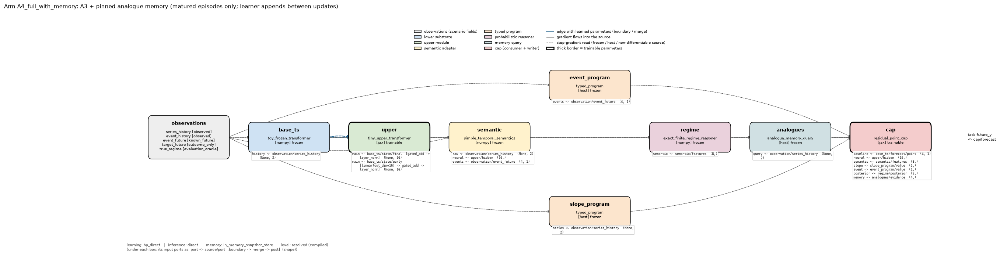
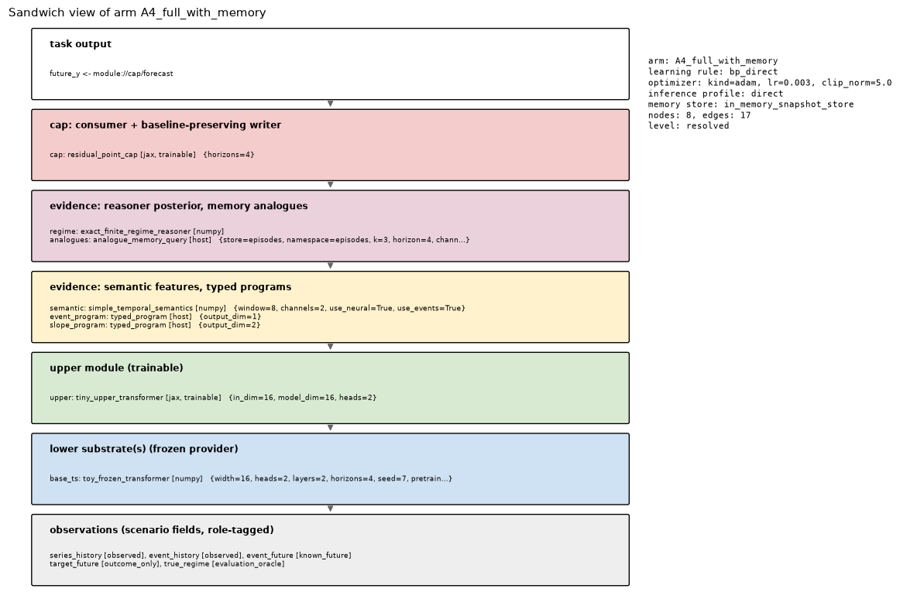
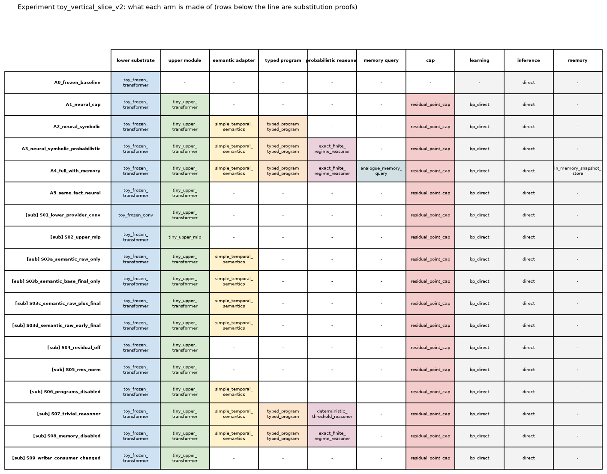
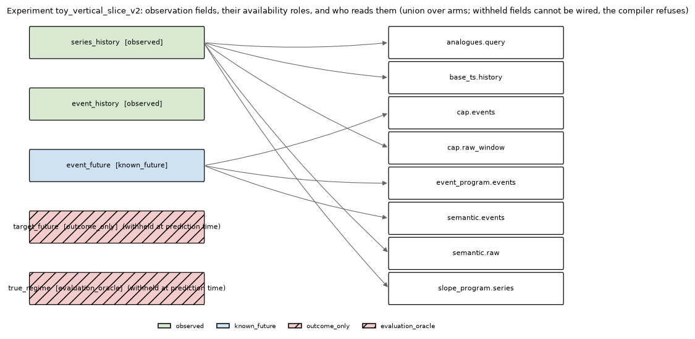
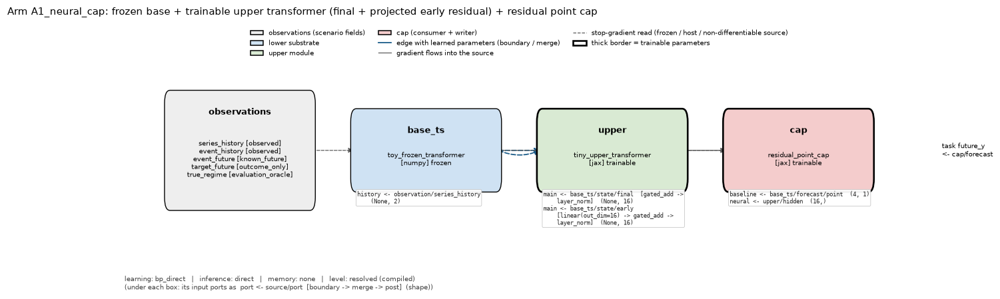
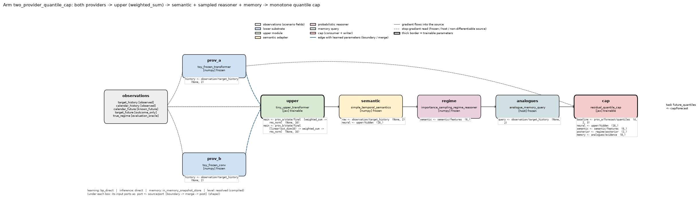
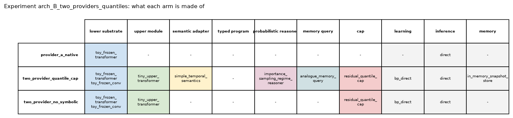
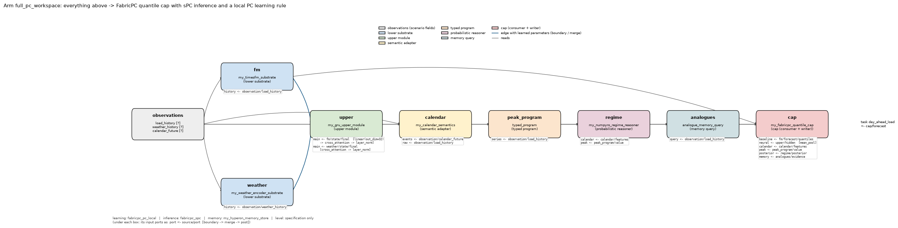
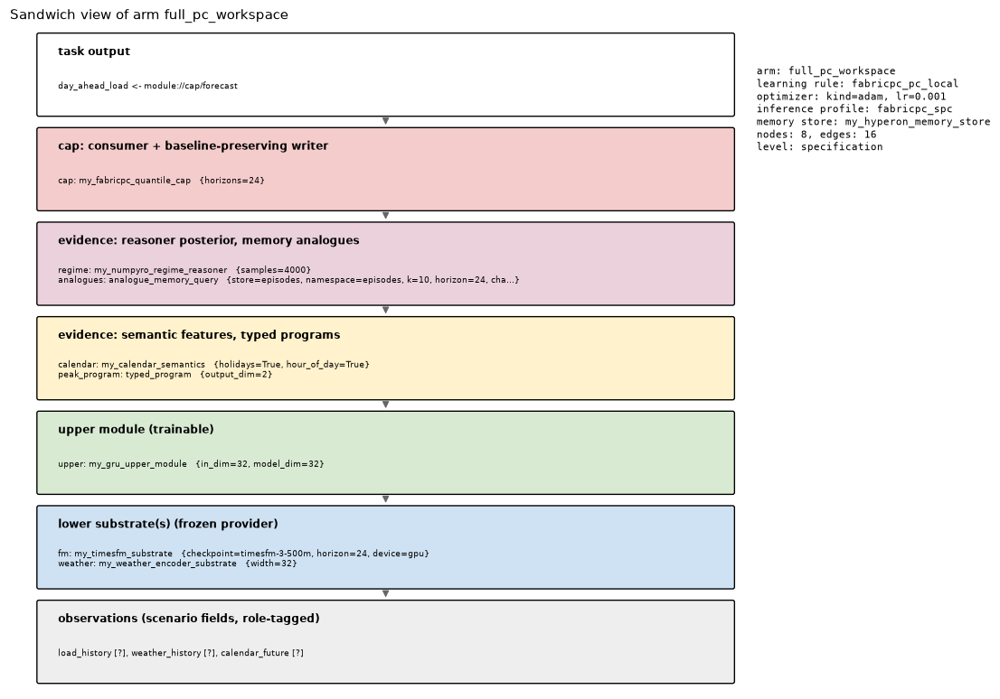
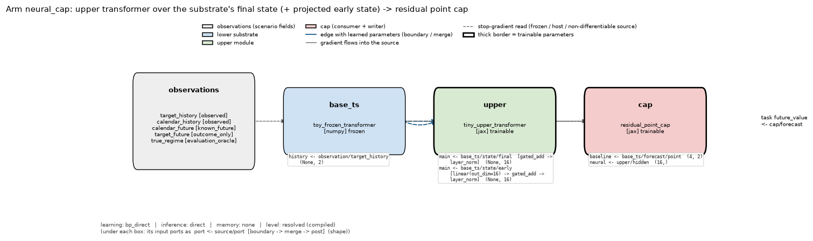

# NESS quick start

*From an empty environment to designing, running and inspecting your own NESS experiments.*

NESS is a platform for building **predictors as compositions**: a frozen neural model at the
bottom, a trainable module above it, explicit symbolic and probabilistic evidence in the
middle, and a "cap" at the top that turns everything into a forecast. You never write glue
code: you describe the composition in **one YAML file**, and the platform validates it, runs
it, checkpoints it and reports on it. When you want a model the platform does not ship, you
write a **plugin** (a Python class in your own package) and refer to it from the YAML.

This guide explains the vocabulary, the one file you configure, the plugins you can use today,
how to design your own architectures, how to draw them, and how to read the results.
Everything in it is generated from, and checked against, the code in this repository.

**Contents**

1. [NESS in one picture](#1-ness-in-one-picture)
2. [Vocabulary: the concepts you need](#2-vocabulary-the-concepts-you-need)
3. [Install and check your environment](#3-install-and-check-your-environment)
4. [Your first run (ten minutes)](#4-your-first-run-ten-minutes)
5. [The experiment file, section by section](#5-the-experiment-file-section-by-section)
6. [Wiring nodes together: ports, selectors, boundaries, merges](#6-wiring-nodes-together-ports-selectors-boundaries-merges)
7. [Plugins you can use today (and their interfaces)](#7-plugins-you-can-use-today-and-their-interfaces)
8. [What you can vary: the design space](#8-what-you-can-vary-the-design-space)
9. [Three architectures](#9-three-architectures)
10. [Seeing your design: `ness graph`](#10-seeing-your-design-ness-graph)
11. [Building blocks: seven small runnable files](#11-building-blocks-seven-small-runnable-files)
12. [Bringing your own data and your own models](#12-bringing-your-own-data-and-your-own-models)
13. [Reading the results](#13-reading-the-results)
14. [Errors you will meet first](#14-errors-you-will-meet-first)
15. [Where next](#15-where-next)

---

## 1. NESS in one picture

The drawing below is produced by the platform itself (`ness graph`) from the reference study's
configuration. It shows one **arm** (one complete predictor) of the toy study that ships with
the repository, resolved through the real compiler: every box is a **node** (a plugin
instance), every arrow a **read** of one node's output port by another node's input port, and
the list under each box says exactly which ports it reads and through which transforms.



Read it left to right:

* **observations** are the scenario's fields, each tagged with an *availability role*. The
  predictor may read `observed` and `known_future` fields; `outcome_only` and
  `evaluation_oracle` fields are withheld at prediction time and the compiler refuses to wire them.
* **base_ts** is a frozen lower **substrate** (here a small pretrained transformer). It exposes
  its internal states (`state/early`, `state/final`) and its own native forecast (`forecast/point`).
* **upper** is a trainable **upper module** reading two substrate states through a learned
  merge (blue arrows carry learned parameters).
* **semantic**, **slope_program**, **event_program** turn raw data and neural state into
  explicit typed evidence (features, program outputs).
* **regime** is a **probabilistic reasoner** producing a posterior over hidden regimes.
* **analogues** is a **memory query** returning matured analogue episodes from a pinned memory view.
* **cap** consumes all of the above plus the baseline forecast and writes a corrected forecast,
  which is what the **task** scores.

Dashed arrows are stop-gradient reads (from frozen or host-side nodes); solid arrows carry
gradients; thick borders mark trainable nodes. The same arm, seen as the "sandwich" it is:



Every layer except the output is optional. An arm can be just a substrate (a control), a
substrate plus a cap, two substrates and no symbolic layer, and so on. Section 9 shows three
very different architectures written in the same language.

## 2. Vocabulary: the concepts you need

| term | what it is | where it lives in the YAML |
|---|---|---|
| **scenario** | the data provider: it yields prediction requests (role-tagged observations at a forecast origin) and, later, the outcomes. A plugin of kind `scenario`. | `scenario:` |
| **observation field** | one named input in a request, with a role: `observed`, `known_future`, `derived`, `outcome_only`, `evaluation_oracle`. Wired as `observation://<field>`. | declared by the scenario; read in `inputs:` |
| **task** | what is predicted and how it is scored: point or quantile forecast, horizons, channels, loss, and the access policy (which roles and memory namespaces a predictor may see). A plugin of kind `task`. | `tasks:` |
| **protocol** | the paired training / evaluation procedure shared by all arms: splits, batch size, number of updates, model seeds, checks. | `protocol:` |
| **arm** | one complete predictor to be compared with the others: a composition plus its learning rule, inference profile and (optional) memory. Arms see identical request streams. | `arms:` |
| **composition** | the directed acyclic graph of nodes for one arm, plus which node/port is the output for each task. | `arms.<id>.composition:` |
| **node** | one plugin instance with an id, a config and its input wiring. | `composition.nodes[]` |
| **plugin** | a Python class implementing one layer contract (`substrate`, `upper_module`, `semantic_adapter`, `program`, `reasoner`, `memory_query`, `cap`, plus `task`, `scenario`, `memory_store`, `learning_rule`, `writer`, `consumer`). Discovered through the `ness.plugins` entry point; `ness plugins` lists them. | `plugin:` |
| **port** | a named, typed input or output of a node (payload kind, shape, semantic type, role, differentiability). Wires are checked port against port at validate time. | `inputs:` keys and `scheme://node/port` values |
| **cap** | the top node: it takes a *baseline* forecast and any number of *feature* ports, runs a consumer (a small trainable network) and a writer that turns the consumer's output into a forecast **without changing the baseline at initialisation**. | a node of kind `cap` |
| **learning rule / inference profile** | separate declarations of *how parameters change* (`bp_direct`, `fabricpc_pc_local`, ...) and *how the workspace computes a prediction* (`direct`, `fabricpc_spc`, ...). | `arms.<id>.learning:` / `arms.<id>.inference:` |
| **memory** | an optional store of durable records; a prediction sees a pinned, causally filtered *view* of it, and a memory-query node lowers query results to evidence. | `arms.<id>.memory:` + a `memory_query` node |
| **substitution** | a complete arm listed under `substitutions:` that must validate, predict target-free, pass the causal check, take one update and restore from checkpoint. The proof that a variation is configuration-only. | `substitutions:` |
| **manifest / checkpoint** | the content-hashed identity of a whole system (every component, config, state) and its saved state; `ness inspect` reads them. | produced by `ness run` |

Two rules explain most of the compiler's behaviour: **a node reads only what its task view
permits** (no withheld field, no forbidden memory namespace), and **gradients never cross a
runtime boundary** (a learned transform cannot feed a frozen, host-side or FabricPC node).

## 3. Install and check your environment

Pick the level you need (each includes the previous):

```bash
python -m venv .venv && . .venv/bin/activate
pip install "ness @ git+https://github.com/guilamacie/NESS.git"            # A: core (numpy, pyyaml). Validate, inspect, host-side plugins.
pip install "ness[jax] @ git+https://github.com/guilamacie/NESS.git"       # B: + NESS JAX backend (CPU). Trainable modules, bp_direct.
pip install "ness[fabricpc] @ git+https://github.com/guilamacie/NESS.git"  # C: + FabricPC 0.6.x backend. PC workspaces and rules.
pip install "ness[report] @ git+https://github.com/guilamacie/NESS.git"    # + matplotlib, pandas: `ness report`, `ness graph`
```

From a clone: `pip install -e ".[dev]"` (core + JAX + report tooling + pytest) and
`pip install -e examples/external_plugin_example` (the third-party plugin package used by some
examples). GPU: `docs/INSTALL.md`.

Then:

```bash
ness doctor --backend jax --platform cpu     # versions, bootstrap order, devices; add --backend fabricpc if installed
ness plugins                                 # every plugin discovered, with kind, version, and missing dependencies flagged
```

## 4. Your first run (ten minutes)

The repository ships a complete study: a synthetic two-regime forecasting problem, six arms
(from "frozen provider only" to "everything plus memory" plus a same-fact neural control),
three model seeds and ten configuration-only substitution proofs.

```bash
ness validate examples/vertical_slice_timeseries/configs/toy_vertical_slice.yaml   # compiles every arm, prints resolved wiring
ness graph    examples/vertical_slice_timeseries/configs/toy_vertical_slice.yaml --out graphs/toy   # draws every arm (section 10)
ness run      examples/vertical_slice_timeseries/configs/toy_vertical_slice.yaml --out runs/toy/first   # ~5 min on CPU
ness evaluate runs/toy/first                 # the summary table
ness report   runs/toy/first                 # 12 figures + a Markdown report from the saved artifacts
```

What each arm is made of, from `ness graph`:



And which observation fields each node reads (the two withheld fields have no readers, by construction):



The published report of this study (`reports/toy_vertical_slice_report.pdf`) documents the
result: the symbolic, probabilistic and memory arms improve slightly and consistently over the
neural-only cap, and the same-fact neural control is best. That null result is the point of
the paired design.

## 5. The experiment file, section by section

**This is the only file you write to use existing plugins.** Everything else (manifests,
checkpoints, metrics, figures) is produced from it. Here is the full skeleton with every key
you can set; the subsections explain each one.

```yaml
schema_version: ness.experiment/3           # required
protocol_id: my_study_v1                     # required; goes into every manifest and artifact

runtime:                                     # optional
  backend: auto                              # auto | numpy | jax | fabricpc   (auto = least capable backend the arms need)
  platform: auto                             # auto | cpu | gpu | tpu
  devices: {platform: any, selection: all, fallback: error}   # optional device policy; fallback: cpu lets a gpu request degrade
  x64: true
  profile: development                       # development | scientific (scientific fails closed on unverified backend versions)
  numerics: {matmul_precision: highest, deterministic: true}   # optional (0.3): recorded in reports and manifests

scenario:                                    # required: the data
  plugin: toy_temporal_dataset
  config: {n_steps: 400, context: 32, horizon: 4, seed: 1234, train_fraction: 0.7}

tasks:                                       # required: one or more
  - id: future_value
    plugin: point_forecast_task              # or quantile_forecast_task
    config: {horizons: 4, channels: [y0, y1], loss: mse, memory_namespaces: [episodes]}

protocol:                                    # required
  train_split: train
  test_split: test
  batch_size: 8                              # requests per optimizer update
  updates: 8                                 # every arm (frozen or trainable) sees batch_size x updates train requests
  seeds: [0, 1, 2]                           # optional model-initialisation seeds; default = each arm's own seed
  max_train_requests: null                   # optional caps
  max_test_requests: 48
  restore_check_requests: 8                  # test requests re-predicted after checkpoint restore (must match exactly)
  retention: full                            # full | outputs (0.3: outputs keeps frozen evaluation memory flat)
  artifacts: {ground_truth: true}            # 0.3: false skips the ground-truth dump (large outcomes)
  causal_check: true                         # perturb withheld outcomes and re-predict

arms:                                        # required: at least one
  my_arm:
    description: free text (appears in diagrams and reports)
    seed: 0
    learning:  {rule: bp_direct, optimizer: {kind: adam, lr: 0.003, clip_norm: 5.0}}   # required if anything is trainable
    inference: {profile: direct}             # optional; direct is the default
    memory: {...}                            # optional; see section 7, "memory"
    composition:
      nodes: [...]                           # section 6
      output: {task: future_value, from: module://cap/forecast}

substitutions: [...]                         # optional: arms that must validate / predict / train / restore (section 8)
```

**Fragments.** YAML anchors (`x-base: &base` ... `*base`) are the intended way to define a
node once and reuse it across arms; the parser only reads the keys above, so top-level fragment
holders (by convention prefixed `x-`) are ignored.

### `runtime`

Usually omitted. `backend: auto` picks the least capable backend the selected arms need
(numpy if nothing is trainable, jax for `bp_direct`, fabricpc for FabricPC caps and rules).
Pin it when you want to *refuse* silently running on the wrong backend. `platform: gpu`
fails closed if no GPU is visible unless `devices.fallback: cpu`. One process bootstraps one
backend; FabricPC and plain JAX arms can share one `ness run` because FabricPC implies JAX.

`numerics` (0.3) fixes the numerical environment that affects results and records it:
`matmul_precision: default | high | highest` sets JAX's matrix-product precision (on GPUs the
default is TensorFloat-32-class, relative error ~3e-4; `highest` is full float32), and
`deterministic: true` adds `--xla_gpu_deterministic_ops=true --xla_gpu_autotune_level=0` to
`XLA_FLAGS` so GPU results are bitwise reproducible across processes. Both are applied before the
first JAX computation; a conflicting `XLA_FLAGS` or `JAX_DEFAULT_MATMUL_PRECISION` in your
environment is an error, not a silent override. Declared numerics (and numeric variables your
environment sets) are part of the manifest identity, so two systems that can predict differently
never share a manifest id.

### `scenario`

Any plugin of kind `scenario`. It declares the observation fields (name, role, shape) and
yields requests per split. The two shipped scenarios:

| plugin | fields | config keys |
|---|---|---|
| `toy_temporal_dataset` | `target_history` (observed, [T,2]), `calendar_history` (observed), `calendar_future` (known_future), `target_future` (outcome_only), `true_regime` (evaluation_oracle) | `n_steps, context, horizon, seed, train_fraction, season_period, regime_switch_prob` |
| `toy_regime_dataset` | `series_history` (observed, [T,2]: target y and auxiliary x), `event_history` (observed), `event_future` (known_future), `target_future` (outcome_only), `true_regime` (evaluation_oracle) | `n_steps, context, horizon, seed, event_period, event_length, segment_length, a, phi_x, sigma_x, b_normal, b_shift, lag_normal, lag_shift, c_normal, c_shift, sigma_normal, sigma_shift, split_fractions` |

Your own data: section 12.

### `tasks`

| plugin | scores | config keys |
|---|---|---|
| `point_forecast_task` | a point forecast per horizon and channel; `loss: mse` or `mae` | `horizons` (int or list), `channels`, `functional` (mean), `loss`, `memory_namespaces` (default `[episodes]`) |
| `quantile_forecast_task` | a quantile forecast (pinball loss) | `horizons`, `channels`, `levels` (increasing, e.g. `[0.1, 0.5, 0.9]`), `memory_namespaces` |

A task also defines the **access policy** every node in the arm runs under: as-of-origin,
observed + known-future fields only, and the listed memory namespaces.

### `protocol`

Every arm sees the same request stream in both phases: prequential training (predict, reveal,
learn every `batch_size` requests, for `updates` updates) and frozen evaluation on the test
split. After training, a learner checkpoint is published and restored, the first
`restore_check_requests` test requests are re-predicted by the restored system (the difference
must be exactly zero), and a causal check re-predicts one request with its withheld outcomes
perturbed and removed. `seeds` runs every arm once per model seed with the dataset seed locked.
Requests without any task outcome (for example a separate preservation stream used only by an
auxiliary objective) are allowed: they are revealed with no outcomes and join the learning batch.
`retention: outputs` drops each test prediction's execution record once scored (test-phase
evidence traces are then not written); `artifacts.ground_truth: false` skips `data/ground_truth.csv`.

### `arms`: `learning`, `inference`, `memory`

* `learning.rule` names a learning-rule plugin. Verified: `bp_direct` (reverse-mode BP through
  the deployed computation; jax runtime; alias `ff_bp`), `fabricpc_pc_local` (clamped settle +
  local PC weight gradients; aliases `workspace_pc_local`, `workspace_epc_local`),
  `fabricpc_bp_through_inference` (BP of the task loss through the FabricPC inference; alias
  `workspace_bp_unroll`). `optimizer.kind` is `adam` or `sgd`, with `lr`, `weight_decay`
  (decoupled) and `clip_norm` (global), plus, from 0.3, `param_groups` and `schedule` (below).
* `learning.objectives` (0.3): what an update minimises beyond the task losses (below).
* `inference.profile`: `direct` (default; feedforward), `fabricpc_feedforward`, `fabricpc_spc`
  (sPC settling), `fabricpc_epc`; `fabricpc_spc_recurrent` is experimental and needs
  `allow_experimental: true`.
* `memory`: attach a store to the arm (section 7, "memory") so `memory_query` nodes have a view to read.

The learning rule owns the trainable parameter groups of nodes in *its* runtime (and the learned
boundary/merge parameters feeding them). A frozen arm has no `learning:`; an arm with a
trainable node and no rule is rejected.

#### Parameter groups and schedules (0.3)

```yaml
learning:
  rule: bp_direct
  optimizer:
    kind: adam
    lr: 0.001
    clip_norm: 1.0                                   # global, over all groups
    schedule: {kind: cosine, warmup_steps: 100, total_steps: 2000, min_lr_ratio: 0.1}   # constant | linear | cosine
    param_groups:                                    # first match wins; each pattern must match an owned group
      - {match: "student/*", lr_scale: 0.1, weight_decay: 0.01}
      - {match: "cap/*", lr: 0.003, grad_multiplier: 1.0, clip_norm: 5.0}
```

Group ids are `node/group` (e.g. `upper/transformer`, `cap/consumer`) or learned-edge ids, as
`ness validate` and the manifest's credit map show. Per update: `grad_multiplier`, then the
group's `clip_norm`, then the global `clip_norm`, then decoupled weight decay
`p * (1 - lr * wd)`, then the step, with `lr = (group lr or lr * lr_scale) * schedule(step)`.
The effective learning rate, gradient norms and update norm of every group are logged to
`metrics/train_history.csv` (`opt/<group>/...`), and the rules go into the manifest.

#### Objectives, training-only nodes, auxiliary targets, anchors (0.3)

```yaml
learning:
  rule: bp_direct
  optimizer: {kind: adam, lr: 0.001}
  objectives:
    - {id: preserve, kind: port_target, weight: 0.5,
       source: module://student/logits,              # a differentiable port (any node the rule trains)
       target: substrate://teacher/logits,           # a constant: a training-only (or other frozen) node's port
       loss: kl_last_axis, loss_config: {source: logits, target_space: logits},
       applies_to: {group: {stream: preservation}}}  # only items whose request.group.stream matches
    - {id: relations, kind: port_target, weight: 1.0,
       source: semantic://rel/features, target: {auxiliary: relation_labels},   # an outcome_only field, revealed to learning only
       loss: cross_entropy, mask: {auxiliary: relation_mask}}
    - {id: keep, kind: parameter_anchor, groups: ["student/*"], weight: 0.001}  # 0.5*w*||theta - theta_initial||^2
composition:
  nodes:
    - {id: teacher, plugin: my_teacher, training_only: true, inputs: {...}}    # never runs for a prediction
```

* With no `objectives`, the task losses are the objective, exactly as before. Declaring a
  `kind: task` objective (`{id, kind: task, task: <task id>, weight, applies_to}`) replaces the
  implicit per-task objectives.
* Each objective is a sum of numerators over a sum of denominators over the items it applies
  to, times its weight; items it does not apply to contribute nothing. Values, weights,
  numerators, denominators and item counts are logged per update (`objective/<id>/...`).
* Built-in losses: `mse`, `kl_last_axis` (KL(target || source) over the last axis, per
  position), `cross_entropy` (integer ids). Your package can add more through the `ness.losses`
  entry point.
* A **training-only** node must be frozen, and only other training-only nodes may read it; the
  compiler rejects any path from it to a task output. It runs only when an objective needs its
  output, on the values the prediction recorded.
* An **auxiliary target** is an `outcome_only` field your scenario declares and puts in the
  bundle; it never reaches a prediction (the compiler refuses to wire it, the causal check
  perturbs it) and `reveal` hands it to learning.
* Objectives other than anchors are evaluated by `bp_direct` in per-item mode; anchors work
  with every rule and their reference is kept in learner checkpoints.

## 6. Wiring nodes together: ports, selectors, boundaries, merges

A node is a plugin instance plus its inputs:

```yaml
- id: upper
  plugin: tiny_upper_transformer
  config: {in_dim: 16, model_dim: 16, heads: 2}
  inputs:
    main: substrate://base_ts/state/final     # input port `main` reads output port `state/final` of node `base_ts`
```

**Selectors** are `scheme://node/port`. The scheme must match the producer's kind, which keeps
the file readable: `observation://<field>`, `substrate://<node>/<port>`,
`module://<node>/<port>` (upper modules and caps), `semantic://`, `program://`, `reasoner://`,
`memory://`. `ness validate` prints every node's ports; a wire whose shape, semantic type,
role or gradient boundary does not fit is rejected before anything runs.

An input can **transform** its source, or **merge** several sources:

```yaml
inputs:
  neural: {from: substrate://base_ts/state/final, boundary: [mean_pool]}             # one source, parameter-free reduction
  main:
    merge: gated_add                                                                 # required when there is more than one source
    sources:
      - substrate://base_ts/state/final
      - {from: substrate://base_ts/state/early, boundary: [{kind: linear, out_dim: 16}]}   # learned projection (edge parameters)
    post: [{kind: layer_norm}]                                                       # transforms applied after the merge
```

| boundary transforms | learned? | note |
|---|---|---|
| `identity`, `flatten`, `mean_pool`, `last_step`, `standardize` | no | shape-changing or normalising reductions; allowed into any runtime |
| `linear` (`out_dim`) | yes | projection; edge parameters owned by the arm's learning rule |
| `layer_norm`, `rms_norm` | yes (affine) | normalisation with learned scale and shift |

| merges | learned? | shape rule |
|---|---|---|
| `concat` | no | concatenates on the last axis; keeps knownness for plain feature evidence |
| `add`, `select` | no | identical shapes / pick one source |
| `gated_add`, `weighted_sum` | yes | identical shapes; learned gate or softmax weights |
| `attention_pool`, `cross_attention` | yes | sequence sources; the first source provides the queries |

**Feature dimensions.** A cap declares `features: {port: dim, ...}`; the compiler checks each
declared dimension against the producing port, so a mismatch is a validate-time error, not a
runtime surprise. A reasoner declares `feature_ports: {port: dim}` the same way.

**Gradient boundaries.** Learned transforms and merges are only legal into a differentiable
destination (a jax node). Into a host-side node (semantic adapter, program, reasoner, memory
query) or a FabricPC node you may only use parameter-free transforms. The compiler says so
explicitly.

## 7. Plugins you can use today (and their interfaces)

`ness plugins` is the authoritative list. Below, for each shipped plugin: its kind, what it
reads and emits, and its configuration keys. Port shapes use `T` (context length), `H`
(horizons), `D` (channels), `Q` (quantile levels), `W` (width).

### Substrates (kind `substrate`, runtime numpy, frozen)

| plugin | input ports | output ports | config |
|---|---|---|---|
| `toy_frozen_transformer` | `history` ([T, D] observation series) | `state/early` [T, W], `state/final` [T, W], `forecast/point` [H, D_out], `forecast/quantiles` [H, D_out, Q] (when `quantile_levels` is set) | `width, heads, layers, channels, forecast_channels (subset), horizons, seed, pretrain_steps, quantile_levels, ff_dim, activation, max_context` |
| `toy_frozen_conv` | `history` | same port contract | `width, kernel, layers, stride, channels, forecast_channels, horizons, seed, pretrain_steps, quantile_levels` |
| `toy_linear_ar_substrate` (external example) | `history` | `state/early`, `state/final`, `forecast/point` | `lags, width, channels, horizons, seed` |

A substrate is a *provider*: it exposes what a real model would (states and native forecasts)
behind `Differentiability.STOP` ports. Two providers with the same port contract are
interchangeable by configuration (the S01 substitution).

### Upper modules (kind `upper_module`, runtime jax, trainable)

| plugin | input ports | output ports | config |
|---|---|---|---|
| `tiny_upper_transformer` | `main` [T, in_dim] | `hidden` [model_dim], `sequence` [T, model_dim] | `in_dim, model_dim, heads` |
| `tiny_upper_mlp` | `main` | `hidden`, `sequence` | `in_dim, model_dim, hidden_dim` |

### Semantic adapter (kind `semantic_adapter`, runtime numpy)

| plugin | input ports | output port | config |
|---|---|---|---|
| `simple_temporal_semantics` | `raw` (required, observation series), optional `neural` (any neural state), `base_context` (neural state), `events` (known-future event indicator) | `features` [n]: slopes(D), volatilities(D), `xcorr_lag{k}` for each `cross_lag_corr` entry, then `neural_cue`, `base_context_cue`, `event_cue` when enabled | `window, channels, cross_lag_corr: [k...], use_neural, use_base_context, use_events` |

Each feature is typed `FeatureEvidence` with a knownness mask and provenance naming the ports
actually consumed. A semantic adapter is the standard way to read *several earlier ports*
(raw data plus neural state plus known-future covariates) and expose them explicitly.

### Typed programs (kind `program`, runtime host)

| plugin | input ports | output port | config |
|---|---|---|---|
| `typed_program` | declared by `port_bindings` (each: `port`, `dim` or `shape`, optional `semantic_type` / `accepts`) | `value` [output_dim] | `output_dim, port_bindings, constants, program` (a `ness.program/1` IR: `inputs`, `output`, `body` of `input / const / call / follow / intersect / union / exists / count` ops) |

Primitives available to `call`: `window_slope`, `window_mean`, `last_value`,
`event_active_at_origin`. Programs run in the reference interpreter with fuel, row and depth
budgets; an unknown output stays *unknown* (knownness false), never silently zero. New
primitives are registered in `ness.symbolic.operators`.

### Probabilistic reasoners (kind `reasoner`, runtime numpy)

| plugin | input ports | output ports | config |
|---|---|---|---|
| `exact_finite_regime_reasoner` | one port per `feature_ports` entry | `posterior` [n_states] (HypothesisEvidence, weights = exact posterior), `moments` | `feature_ports: {port: dim}`, `model: {latent_name, states, prior, emission: {family: gaussian_diag, means [S x F], scales [S x F]}}` |
| `importance_sampling_regime_reasoner` | same | `posterior` (approximate posterior; effective sample size in diagnostics), `moments` | same + `samples` |
| `deterministic_threshold_reasoner` (external example) | `features` | `posterior` (one-hot) | `states, feature_ports, feature_index, threshold` |

The feature vector is the concatenation of the declared ports in their declared order;
emission parameters are fitted *on the training split* by you
(`examples/vertical_slice_timeseries/fit_regime_emissions.py` shows how) and recorded in the config.

### Memory (kind `memory_store` and `memory_query`)

| plugin | role | config |
|---|---|---|
| `in_memory_snapshot_store` | the reference `MemoryStore`: immutable content-addressed snapshots, `fork / append / seal`, causal views, analogue and list queries | none |
| `analogue_memory_query` (runtime host) | input `query` [T, query_channels]; outputs `evidence` [H x channels] (mean matured continuation of the top-k analogues; knownness false when nothing eligible) and `retrieval` (ids, candidates, completeness, truncation, view id) | `store` (the arm's memory name), `namespace, k, horizon, channels, query_channels` |

Attaching memory to an arm:

```yaml
memory:
  name: episodes                              # what memory-query nodes name in `store:`
  store: {plugin: in_memory_snapshot_store}   # any plugin of kind memory_store
  namespace: episodes                         # must be in the task's memory_namespaces
  seed_from_scenario: true                    # initial snapshot: episodes matured before the first train origin
  learner_appends: true                       # revealed episodes appended on a learner branch, published between updates
  episode_window_field: target_history        # observation field forming the episode window
```

No `memory:` section means no store, no view, nothing to isolate. A `memory://` consumer
without it compiles but fails at the first prediction with an explicit message.

### Caps (kind `cap`)

| plugin | runtime | baseline port | output ports | config |
|---|---|---|---|---|
| `residual_point_cap` | jax, trainable | `baseline` (point forecast [H, D]) + one port per `features` entry | `forecast` [H, D], `correction` | `channels, horizons, features: {port: dim}`, optional `consumer` (default `concat_linear_consumer`), `writer` (default `point_residual_writer`) |
| `residual_quantile_cap` | jax, trainable | `baseline` (quantile forecast [H, D, Q]) + features | `forecast` [H, D, Q] (monotone), `correction` | `channels, horizons, levels, features, consumer, writer` (default `monotone_quantile_writer`) |
| `jax_dense_workspace_cap` | jax, trainable | same as the point cap | same | + `hidden: [..]` (a small MLP workspace; the parity twin of the FabricPC cap) |
| `fabricpc_residual_cap` | fabricpc | same as the point cap; only parameter-free boundaries may feed it | same | + `hidden: [..]`, `inference: {profile: fabricpc_feedforward|fabricpc_spc|fabricpc_epc, eta_infer, infer_steps}` |

Writers and consumers are plugins too (`point_residual_writer`, `monotone_quantile_writer`,
`bounded_point_writer` from the external example, `concat_linear_consumer`), so the S09
substitution swaps them by configuration. Every cap is **baseline-preserving at zero**: with
freshly initialised parameters it reproduces the baseline forecast exactly, which is what makes
"baseline vs. cap" a fair comparison.

## 8. What you can vary: the design space

Everything below is a change to the YAML only, and every one of them is exercised by a
shipped example or substitution proof.

| dimension | choices | example |
|---|---|---|
| number of substrates | one, two, ... of the same or different families | B: `toy_frozen_transformer` + `toy_frozen_conv` |
| which layers exist | any subset of upper / semantic / program / reasoner / memory / cap | toy arms A0-A5 |
| what each node reads | any earlier port the task view permits: raw fields, substrate states (early or final), upper state, other evidence | S03a-d: the semantic adapter reads raw only, raw + base final, raw + early + final ... |
| how sources combine | fixed (`concat`, `add`, reductions) or learned (`linear`, `gated_add`, `weighted_sum`, attention) | S04 (residual off), S05 (`layer_norm` to `rms_norm`), B (`weighted_sum` + `rms_norm`) |
| prediction space | point or quantile output, per-task loss, several tasks | 07 and B (quantiles) |
| numerical backend | numpy (frozen only), NESS JAX, FabricPC | 06: the same cap on FabricPC |
| learning rule | `bp_direct`, `fabricpc_pc_local`, `fabricpc_bp_through_inference` (+ aliases) | 06 |
| inference profile | `direct`, `fabricpc_feedforward`, `fabricpc_spc`, `fabricpc_epc` | 06 |
| memory | none, or a store with seeding and learner appends; any `MemoryStore` implementation | 04, B, C |
| reasoner | exact, sampled, deterministic, or your own (NumPyro/Pyro) | S07 |
| cap internals | consumer and writer plugins | S09 |
| controls | frozen native forecast; same-fact neural control (the raw facts the symbolic path reads, fed to the cap directly) | A0 and A5; B's `two_provider_no_symbolic` |
| seeds and protocol | model seeds, batch size, updates, checks | `protocol:` |
| providers and plugins | any package registering `ness.plugins` entry points | 05 |

A **substitution** is how you prove a variation is configuration-only: list the variant arm
under `substitutions:` and `ness run` validates it, predicts target-free, runs the causal
check, takes one update (when trainable) and restores it from a checkpoint, recording the result
in `metrics/substitution_matrix.*` next to the core source hash.

## 9. Three architectures

### A. The reference toy study (runs; results published)

File: `examples/vertical_slice_timeseries/configs/toy_vertical_slice.yaml`. Dataset: target
`y`, auxiliary `x`, scheduled events `e` known in advance, and a hidden two-state regime that
changes the dynamics (an `evaluation_oracle` field the predictors cannot read). Arms A0 to A5
add one mechanism at a time; A5 is the same-fact neural control.

The simplest learned arm, A1, is a substrate, an upper module and a cap:



The full arm A4 was shown in section 1. Ten substitutions swap the provider, the upper module,
the semantic adapter's inputs, the residual, the normalisation, the programs, the reasoner, the
memory, and the cap's writer and consumer. Result summary (three seeds, test MAE): A0 0.646,
A1 0.624, A2 0.608, A3 0.607, A4 0.594, A5 0.524; every substitution passes; checkpoint restore
differences are exactly zero; causal checks pass. `reports/toy_vertical_slice_report.pdf` is the
write-up.

### B. Two providers, one workspace, quantile output (validates and runs)

File: `examples/quickstart/B_two_providers_quantiles.yaml`. Two frozen providers of different
families feed one upper module through a learned `weighted_sum` (provider B projected by a
learned `linear`), followed by a semantic adapter with a cross-lag correlation feature, an
importance-sampling reasoner, analogue memory and a **monotone quantile cap** that corrects
provider A's native quantiles. A same-fact control feeds the flattened raw window to the cap
instead of the symbolic layer.





```bash
ness validate examples/quickstart/B_two_providers_quantiles.yaml
ness run examples/quickstart/B_two_providers_quantiles.yaml --out runs/B      # two seeds, about a minute
```

### C. Bring your own models (a template you fill with your plugins)

File: `examples/quickstart/C_bring_your_own_models.yaml`. This is what a *real* instance looks
like: a frozen foundation forecaster wrapped as a substrate, a second frozen encoder over
exogenous inputs, your own GRU upper module reading both through `cross_attention`, a
calendar semantic adapter over known-future fields, a typed program, a NumPyro reasoner, a
Hyperon-backed memory store, and a FabricPC quantile cap with sPC inference and a local PC
learning rule on GPU. The plugin ids prefixed `my_` do not exist yet; `ness graph --spec-only`
draws the design anyway, and `ness validate` will pass once you have written them.





What you would write, and where to learn how:

| placeholder | kind | contract to implement | handoff section |
|---|---|---|---|
| `my_energy_market_dataset` | `scenario` | `ScenarioProvider`: fields with roles, requests per split, outcomes, optional `matured_episodes` | `AGENT_HANDOFF.md` §8 |
| `my_timesfm_substrate`, `my_weather_encoder_substrate` | `substrate` | `MacroModule` exposing `state/*`, `forecast/*` with STOP ports and a frozen parameter group | §2 |
| `my_gru_upper_module` | `upper_module` | `MacroModule` + `apply(params, dense_inputs, state, xp)`; trainable group; runtime jax | §3 |
| `my_calendar_semantics` | `semantic_adapter` | reads several earlier ports; emits `FeatureEvidence` with `used_inputs` | §4 |
| `my_numpyro_regime_reasoner` | `reasoner` | `ProbabilisticReasoner` capabilities; `HypothesisEvidence` with honest weight semantics | §5 |
| `my_hyperon_memory_store` | `memory_store` | the `MemoryStore` protocol (`open_view, query, fork, append, seal`) | §6 |
| `my_fabricpc_quantile_cap` | `cap` | a FabricPC workspace cap with a monotone quantile writer | §7, `FABRICPC_BACKEND.md` |

## 10. Seeing your design: `ness graph`

```bash
ness graph <config.yaml> [--out DIR] [--arms a b] [--spec-only] [--no-substitutions] [--format png|svg|pdf] [--dpi N]
```

For each arm it writes `<arm>__composition` (the graph: boxes by layer, arrows for reads,
per-port wiring under each box, learned edges in blue, stop-gradient reads dashed, trainable
nodes with a thick border) and `<arm>__stack` (the sandwich view with the arm's learning,
inference and memory declarations); for the experiment it writes `experiment__arms` (one row
per arm and substitution, one column per layer) and `experiment__data_access` (observation
fields, roles and readers).

Two levels of detail. By default it compiles each arm through the real compiler and shows
runtimes, port shapes and gradient boundaries ("level: resolved"). When a plugin is missing (a
design you have not implemented yet, or a runtime extra you have not installed) it falls back
to the configuration alone and says so ("level: specification only"); `--spec-only` forces
that. Every image in this guide was produced this way.

## 11. Building blocks: seven small runnable files

Each runs in well under a minute on CPU with `ness run examples/quickstart/<file> --out runs/qs/<name>`.

| file | shows | needs |
|---|---|---|
| `01_baseline_only.yaml` | the frozen provider's own forecast, no learning: the control arm | core |
| `02_neural_cap.yaml` | substrate, trainable upper module (gated residual merge), residual cap; `learning:` | jax |
| `03_symbolic_probabilistic.yaml` | + semantic adapter, typed program, exact two-state reasoner feeding the cap | jax |
| `04_with_memory.yaml` | + a memory store attached to the arm and an analogue query lowered to evidence | jax |
| `05_external_plugin_substitution.yaml` | third-party substrate, reasoner and writer; `substitutions:` proofs | jax + example plugin |
| `06_fabricpc_workspace.yaml` | the cap on FabricPC: feedforward BP vs. sPC settling + local PC rule | fabricpc |
| `07_quantiles.yaml` | a different prediction space: native quantiles, pinball loss, monotone quantile cap | jax |



These protocols are deliberately tiny (a few hundred steps, six to eight updates). Expect the
learned arms *not* to beat the frozen baseline at that budget; the paired control is exactly
what tells you so. `tests/test_quickstart_configs.py` keeps every file valid.

## 12. Bringing your own data and your own models

**Your data** is a `scenario` plugin implementing `ScenarioProvider`
(`ness.plugin_api.protocols`): `observation_fields()` declares each field with its role,
`iter_requests(split, tasks, protocol)` yields target-free requests at forecast origins,
`outcome(request_id, query_id)` reveals outcomes afterwards, `grouping_metadata` tags requests
for diagnostics, and optionally `matured_episodes(before_origin, namespace)` lets memory seed
itself. `src/ness/scenarios/toy_regime.py` is a complete small example including an oracle
field predictors cannot read.

**Your models** are plugins. A plugin class declares `plugin_id`, `plugin_version`,
`module_kind`, `runtime` (`numpy`, `host`, `jax`, `fabricpc`, or `jax_inference` for a frozen
module that computes with JAX but is never differentiated), implements `validate_config`,
`describe()` (ports, parameter groups, capabilities), `initialize(rng)` and
`forward(inputs, state, ctx)`; trainable modules also implement
`apply(params, dense_inputs, state, xp)` so the same code runs eagerly (numpy) and under
tracing (jax). State is snapshotted and restored as restricted data. Registration is one entry
point in your package:

```toml
[project.entry-points."ness.plugins"]
my_substrate = "my_package.descriptors:MY_SUBSTRATE"   # PluginDescriptor(id, kind, version, "module:Class", requires, summary)
```

Your models and data live in **your own package**; the platform is a dependency you install and
never edit (`ness audit --strict` proves the installed core matches the release). Start from
`examples/external_plugin_example/` (a substrate, a reasoner, a writer and a heavy-dependency
plugin, with tests built on `ness.plugin_api.testkit`), then follow
[`AGENT_HANDOFF.md`](AGENT_HANDOFF.md), which states exactly which files an instance may create
and must never modify and walks through one plugin per layer with the contracts each must honour, and [`CONTRIBUTING_PLUGINS.md`](CONTRIBUTING_PLUGINS.md) for the
lifecycle and state rules. Wrapping a real frozen model means implementing a `substrate` that
exposes `state/*` and `forecast/*` ports with `Differentiability.STOP` and a frozen parameter
group; the port contract, not the library, is what the rest of the system sees.

**Programmatic use**, when a script is more convenient than the CLI:

```python
from ness.config import load_experiment
from ness.plugin_api import default_registry
from ness.runtime.system import NessSystem
from ness.runtime.transaction import PredictionTransaction

exp = load_experiment("examples/quickstart/02_neural_cap.yaml")
system = NessSystem.build(exp, exp.arm("neural_cap"), default_registry())
scenario, tasks = system.scenario, tuple(system.tasks.values())
tx = PredictionTransaction(system, mode="prequential")
for req in scenario.iter_requests("train", tasks, {"max_requests": 16}):
    rec = tx.predict(req)                                            # immutable, target-free
    tx.reveal(req.request_id, {q.task_id: scenario.outcome(req.request_id, q.query_id) for q in req.queries})
    if tx.pending_batch_size() == 8:
        print(tx.learn_step())                                       # one complete update
print(system.manifest().manifest_id, tx.aggregate_scores())
```

## 13. Reading the results

A run directory is self-describing:

| path | content |
|---|---|
| `summary.txt`, `report.json` | the table `ness evaluate` prints; the full report (arms, paired deltas, substitutions, runtime) |
| `config/` | the experiment file as run and the resolved protocol |
| `metrics/summary.json`, `summary.csv` | per arm and seed: test loss, MAE, RMSE, updates, restore difference (must be 0), causal-check verdict, seconds, peak RSS |
| `metrics/train_history.csv`, `timing.csv` | batch losses per update; wall-clock per phase |
| `metrics/substitution_matrix.json`, `.csv` | the proofs, one row per substitution, with resolved plugins and the core source hash |
| `predictions/*.csv` | every prediction and truth per arm, seed, phase, origin, horizon |
| `traces/*_evidence.csv` | the typed evidence every node produced for every request |
| `manifests/`, `checkpoints/` | whole-system manifests and content-addressed state; `ness inspect <run>/checkpoints <id>` |
| `data/` | the dataset as generated, its manifest, splits and ground truth (oracle fields included, for evaluation only) |
| `environment/` | package versions, runtime report, core source hash |
| `plots/`, `report/` | written by `ness report`: twelve figures and the Markdown report |

`ness report <run>` regenerates the figures and the Markdown report from these files alone,
so a plot can always be traced to saved numbers.

## 14. Errors you will meet first

| message | meaning | fix |
|---|---|---|
| `has trainable parameter groups [...] but no learning.rule` | a node or edge is trainable | add `learning:` to the arm, or use a frozen provider only |
| `feature port X delivered (n,), declared (m,)` | cap `features:` dimension differs from the producer | set the declared dimension to what `ness validate` prints for the port |
| `memory query node ... requires memory store ... attached` | a `memory://` consumer without `memory:` | add the memory section or remove the node |
| `plugin 'X' requires ['jax'] which are not installed` | the plugin's runtime extra is missing | `pip install "ness[jax]"` (or `[fabricpc]`) |
| `learned boundary transform 'linear' feeds a non-differentiable runtime` | a `linear`/gated boundary feeds a host or FabricPC node | use a parameter-free boundary (`mean_pool`, `flatten`, ...) |
| `runtime already bootstrapped ... cannot re-initialise JAX` | two incompatible runtime requests in one process | run the FabricPC arm in a fresh process, or bootstrap it first |
| `AccessPolicyViolation` | a wire reads a field the task view forbids (an outcome, an oracle, a namespace) | it is the design working; read only permitted fields |
| `no plugin registered with id 'X'` | the plugin package is not installed, or its entry point is misspelt | `pip install` the package; check `ness plugins` |
| `optimizer.param_groups patterns [...] match no owned parameter group` | a group pattern matches nothing trainable | check group ids with `ness validate` / the manifest credit map |
| `objective X: source ... is not differentiable` | the objective's source is a frozen or host port | point `source` at a port of a trainable jax node |
| `reads training-only node` | a predicting node or task output reads a training-only node | only training-only nodes and objectives may read it |
| `a node needed the 'jax' backend on demand` | a plugin computes with JAX but declares runtime `numpy` | declare `runtime = "jax_inference"` (or set `runtime.backend: jax`) |
| `runtime.numerics ... conflicts with` | your environment already sets a different XLA flag or matmul precision | remove one of the two |

## 15. Where next

* [`ARCHITECTURE.md`](ARCHITECTURE.md): how the platform is built (packages, contracts,
  compiler, runtime, transaction, learning, backends, checkpoints, experiments).
* [`AGENT_HANDOFF.md`](AGENT_HANDOFF.md): implementing your own instance, layer by layer.
* [`COMPOSITION_GRAPH.md`](COMPOSITION_GRAPH.md), [`PROBABILISTIC_REASONERS.md`](PROBABILISTIC_REASONERS.md),
  [`CHECKPOINT_CONTRACT.md`](CHECKPOINT_CONTRACT.md), [`FABRICPC_BACKEND.md`](FABRICPC_BACKEND.md).
* [`../IMPLEMENTATION_STATUS.md`](../IMPLEMENTATION_STATUS.md): verified, experimental, design-only.
